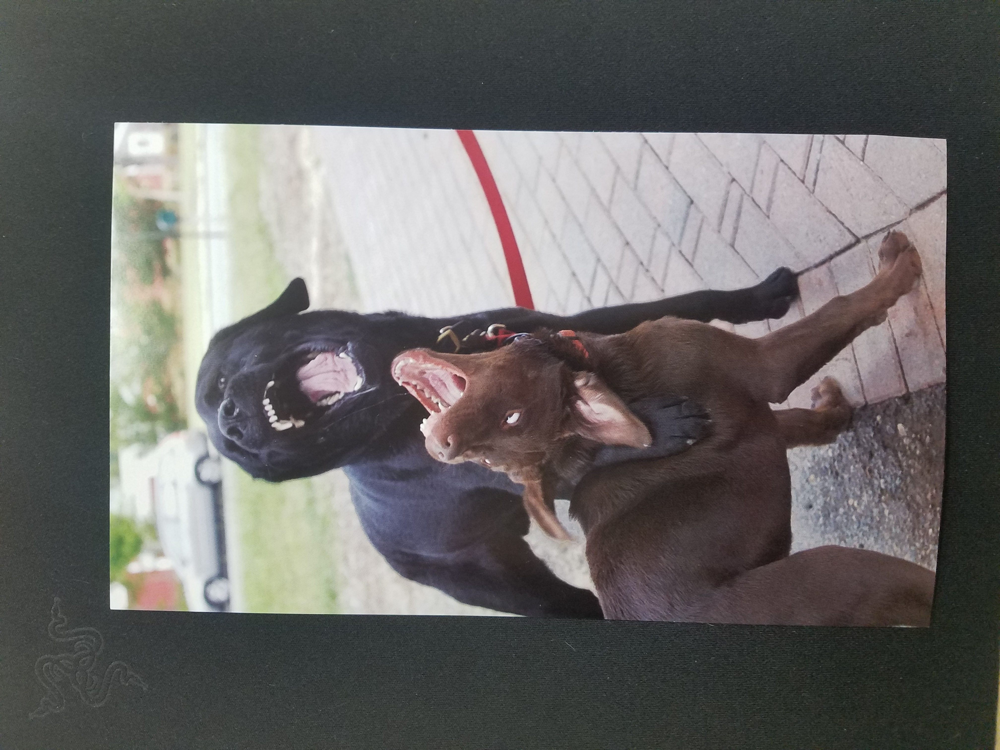
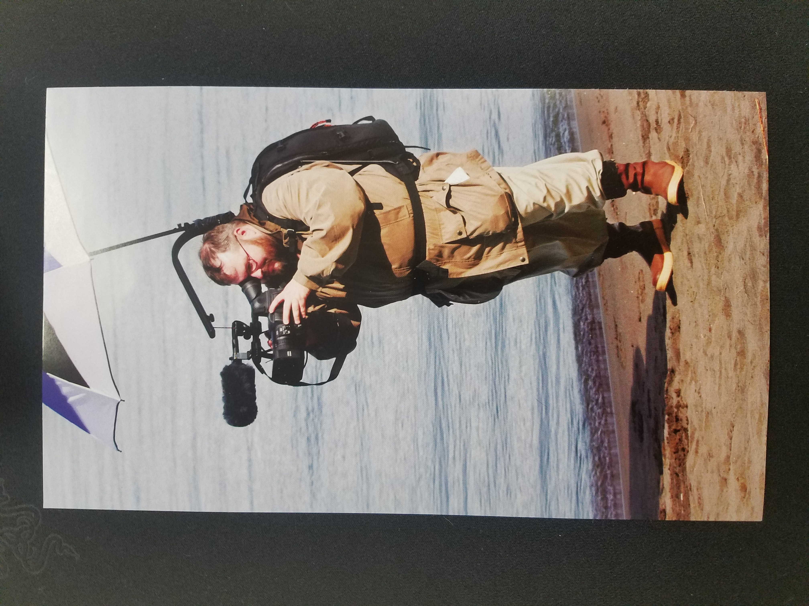

<!doctypehtml>

<h1>Anthony Chavez
Professional Development</h1>

<h3>Career Buddy: Ryan Becker</h3>

<h3>My Links</h3>

<a href="Anthony Chavez chavo copy(1).pdf">Resume</a
    
<a href="https://www.linkedin.com/in/anthony-chavez-a9913aa1/">LinkedIn</a
    
<h3>My Learning Style</h3>
<ul>
<li>20% Auditory</li>
<li>50% Visual</li>
<li>30% Tactile</li></ul>

<h3>Quantitative Accomplishments</h3>
 <ul>
   <li> Repaired electronic equipment worth over $800,000.</li>
   <li>Managed turn in of equipment.</li>
   <li>Utilize time management.</li></ul>
   
<h3>Qualitative Features</h3>
<ul>
   <li> prioritizing tasks</li>                                                       
   <li>Problem solving </li>
   <li>Management experiance</li></ul>
                    
<h3>Paragraph</h3>
                                                                 
   <p1> I genuinly like to brew honey wine you come to find out there is alot that goes into it Sciantifically and practically, From the selection of honey the type of yeast you use can all be factored in. Its a very simple beverage to make but to make mead interesting its good to be creative. But to make it correctly measurment is important. the whole process requires an even balance of qualitative and quantatative aspects to produce a good honey wine.</p1>
                                                                 
<h3>Golden Circle</h3>
<ul>
    <li><h4>why?</h4> I would like to live in a world that has been advanced by technology bettering peoples lives and creating a world that is fun and interactive.</li></ul>
<ul>
    <li><h4>How?</h4> By developing programs and tech to ease peoples lives.</li>
    <li><h4>What?</h4> by working with entreprenuers within the state using my newly aquired skills to produce a meaningfull product.</li></ul>

<h8>Elevator Pitch</h3>

<h3>Version 1</h3>
 
 
 Hi my name is  Anthony I am a digital media specialist I use tools that help in providing a fun and interactive environment, currently I am working on a project with garcia automotive using VR to enhance the experiance of the customer what project are you working on?

 
<h3>Version 2</h3>
                                                                                                                                                                                                                                                  
  
Hi im Anthony I work as a digital media specialist using tools and programs to help provide a fun and interactive environment, currently I am working on a project with Garcia Automotive using VR to enhabce the experiance of the customer and providing information on the product, what projects are you working on?

  
<h3>Picture of my visual speaks</h3>

                                                                 

                                                                 
<h3>Weekly Reflections</3>

<h3>Week 1</h3>

During the first week in the class we began working on our first project which was building a prototype board game, the class acheived this by breaking up into teams, Later in the week each team played and reviewed each others game. We were then approached by our class leader Rod with a proposal to encorperate VR into a local buisiness while the project was successfull the team that worked on the video APP that utilized our VR project won 2nd place for their app.

<h3>Week 2</h3>

As this week progressed I am begining to see that this program thrives off of creative freedom, In digital media you are given the tools and are aloted the oportunity to practice using the tools you were given to produce a project that can be creative and at times frustrating.

<h3>Week 3</h3>

 During week 3 we had created a comercial using program software called Vyond, my comercial consisted of an advertisment for a donut company the project was interesting and the program I worked with helped to produce the narroration for my video. We have continued the week by working on our project with unity creating playable games using the software and techniques learned in class and from the program. Along with working on these assighnments I have been working on projects to inhance my portfolio one of them being a podcast using adobe to work with. My other projects consist of working with Garcia Subaru on our SeeAR project and CNM nature walk currently my plate is full but I still enjoy the creativeness.

